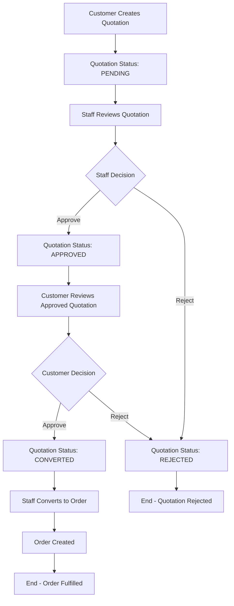

# Quotation System Documentation

## Overview

The quotation system allows customers to request custom quotations for optical products and enables staff/admin to review, approve, and convert quotations into orders. The system supports a complete workflow from quotation creation to order fulfillment.

## System Architecture

### Backend Components

1. **Models**: `Quotation.ts` - Database schema and validation
2. **Controllers**: `quotation.controller.ts` - HTTP request handling
3. **Services**: `quotation.service.ts` - Business logic layer
4. **Routes**: `quotation.ts` - API endpoint definitions
5. **Middleware**: `quotationValidation.middleware.ts` - Input validation
6. **Utils**: `orderUtils.ts` - Quotation number generation

### Frontend Components

1. **Customer Pages**: `/quotations` - Customer quotation management
2. **Staff Pages**: `/staff/quotations` - Staff quotation management
3. **Admin Pages**: Admin quotation oversight

## Quotation Workflow



## API Endpoints

### Customer Endpoints

#### Create Quotation
- **POST** `/api/v1/quotations`
- **Access**: Private (Customer, Staff, Admin)
- **Body**:
  ```json
  {
    "customerName": "John Doe",
    "customerEmail": "john@example.com",
    "customerPhone": "+1234567890",
    "items": [
      {
        "productId": "product_id_here",
        "quantity": 1,
        "specifications": {
          "material": "Titanium",
          "color": "Black",
          "size": "Large",
          "lensType": "Progressive",
          "prescription": "Custom prescription details"
        }
      }
    ],
    "notes": "Special requirements",
    "prescriptionFile": "file_url_here"
  }
  ```

#### Get User Quotations
- **GET** `/api/v1/quotations`
- **Access**: Private (Customer, Staff, Admin)
- **Query Parameters**: `page`, `limit`

#### Get Quotation by ID
- **GET** `/api/v1/quotations/:id`
- **Access**: Private (Customer, Staff, Admin)

#### Customer Approve Quotation
- **PUT** `/api/v1/quotations/:id/customer-approve`
- **Access**: Private (Customer)
- **Description**: Customer approves a staff-approved quotation

#### Customer Reject Quotation
- **PUT** `/api/v1/quotations/:id/customer-reject`
- **Access**: Private (Customer)
- **Body**:
  ```json
  {
    "reason": "Price too high"
  }
  ```

### Staff/Admin Endpoints

#### Get All Quotations
- **GET** `/api/v1/quotations/all`
- **Access**: Private (Staff, Admin)
- **Query Parameters**: `page`, `limit`, `status`, `search`

#### Approve Quotation
- **PUT** `/api/v1/quotations/:id/approve`
- **Access**: Private (Staff, Admin)
- **Body**:
  ```json
  {
    "staffNotes": "Approved with modifications"
  }
  ```

#### Reject Quotation
- **PUT** `/api/v1/quotations/:id/reject`
- **Access**: Private (Staff, Admin)
- **Body**:
  ```json
  {
    "reason": "Insufficient product information",
    "staffNotes": "Please provide prescription details"
  }
  ```

#### Add Staff Reply
- **POST** `/api/v1/quotations/:id/staff-reply`
- **Access**: Private (Staff, Admin)
- **Body**:
  ```json
  {
    "message": "We can offer a 10% discount on this quotation"
  }
  ```

#### Update Quotation
- **PUT** `/api/v1/quotations/:id`
- **Access**: Private (Staff, Admin)
- **Body**:
  ```json
  {
    "items": [...],
    "notes": "Updated notes",
    "staffNotes": "Internal staff notes"
  }
  ```

#### Convert Quotation to Order
- **POST** `/api/v1/quotations/:id/convert`
- **Access**: Private (Staff, Admin)
- **Description**: Converts customer-approved quotation to order

#### Delete Quotation
- **DELETE** `/api/v1/quotations/:id`
- **Access**: Private (Customer, Staff, Admin)
- **Description**: Only pending quotations can be deleted

## Quotation Status Flow

1. **PENDING**: Initial status when quotation is created
2. **APPROVED**: Staff has approved the quotation
3. **REJECTED**: Staff or customer has rejected the quotation
4. **CONVERTED**: Customer has approved and quotation is ready for order conversion
5. **EXPIRED**: Quotation has passed its validity period

## Data Model

### Quotation Schema

```typescript
interface IQuotation {
  quotationNumber: string;        // Auto-generated: QUO-YYYYMMDD-XXXX
  userId?: string;               // Customer user ID (optional for guest quotations)
  customerName: string;          // Customer name
  customerEmail: string;         // Customer email
  customerPhone?: string;        // Customer phone (optional)
  items: IQuotationItem[];      // Array of quotation items
  subtotal: number;             // Subtotal before tax and discount
  tax: number;                  // Tax amount
  discount: number;             // Discount amount
  totalAmount: number;          // Final total amount
  status: QuotationStatus;      // Current status
  notes?: string;               // Customer notes
  prescriptionFile?: string;    // Prescription file URL
  validUntil: Date;             // Quotation validity period (30 days)
  
  // Staff fields
  approvedAt?: Date;            // When staff approved
  approvedBy?: string;          // Staff member who approved
  rejectedAt?: Date;            // When staff rejected
  rejectedBy?: string;          // Staff member who rejected
  rejectedReason?: string;      // Staff rejection reason
  staffNotes?: string;          // Internal staff notes
  
  // Customer approval fields
  customerApprovedAt?: Date;    // When customer approved
  customerRejectedAt?: Date;    // When customer rejected
  customerRejectionReason?: string; // Customer rejection reason
  
  // Communication
  staffReplies?: Array<{        // Staff replies to customer
    message: string;
    staffId: string;
    repliedAt: Date;
  }>;
  
  // Order conversion
  convertedAt?: Date;           // When converted to order
  convertedToOrder?: string;    // Order ID if converted
  
  // Timestamps
  createdAt: Date;
  modifiedAt: Date;
}
```

### Quotation Item Schema

```typescript
interface IQuotationItem {
  productId: string;            // Product reference
  productName: string;          // Product name (cached)
  productImage: string;         // Product image URL (cached)
  quantity: number;             // Quantity requested
  unitPrice: number;            // Unit price at time of quotation
  totalPrice: number;           // Total price for this item
  specifications: {             // Product specifications
    material?: string;
    color?: string;
    size?: string;
    lensType?: string;
    prescription?: string;
  };
}
```

## Validation Rules

### Create Quotation Validation

- **customerName**: Required, 2-100 characters
- **customerEmail**: Required, valid email format
- **customerPhone**: Optional, valid phone format
- **items**: Required array, minimum 1 item
  - **productId**: Required for each item
  - **quantity**: Required, minimum 1
  - **specifications**: Optional object
- **notes**: Optional, maximum 1000 characters
- **prescriptionFile**: Optional string

### Staff Reply Validation

- **message**: Required, 1-1000 characters

### Rejection Validation

- **reason**: Required, 5-500 characters
- **staffNotes**: Optional, maximum 1000 characters

## Business Rules

1. **Quotation Validity**: Quotations are valid for 30 days from creation
2. **Status Transitions**: 
   - PENDING → APPROVED (staff only)
   - PENDING → REJECTED (staff only)
   - APPROVED → CONVERTED (customer approval)
   - APPROVED → REJECTED (customer rejection)
3. **Inventory Check**: Product inventory is checked during quotation creation
4. **Order Conversion**: Only CONVERTED quotations can be converted to orders
5. **Access Control**: Customers can only access their own quotations
6. **Staff Access**: Staff and admin can access all quotations

## Notification System

The system sends notifications for:

1. **Quotation Created**: Notify staff of new quotation
2. **Quotation Approved**: Notify customer of staff approval
3. **Quotation Rejected**: Notify customer of staff rejection
4. **Customer Approval**: Notify staff of customer approval
5. **Customer Rejection**: Notify staff of customer rejection
6. **Staff Reply**: Notify customer of staff message
7. **Order Conversion**: Notify customer of order creation

## Error Handling

### Common Error Codes

- `VALIDATION_ERROR`: Input validation failed
- `PRODUCT_NOT_FOUND`: Referenced product doesn't exist
- `INSUFFICIENT_INVENTORY`: Not enough product stock
- `INVALID_STATUS`: Invalid status transition
- `EXPIRED`: Quotation has expired
- `FORBIDDEN`: Access denied
- `NOT_FOUND`: Quotation not found

### Error Response Format

```json
{
  "success": false,
  "error": "ERROR_CODE",
  "message": "Human readable error message",
  "details": ["Additional error details"]
}
```

## Usage Examples

### Creating a Quotation

```javascript
const quotationData = {
  customerName: "John Doe",
  customerEmail: "john@example.com",
  customerPhone: "+1234567890",
  items: [
    {
      productId: "64a1b2c3d4e5f6789012345",
      quantity: 1,
      specifications: {
        material: "Titanium",
        color: "Black",
        lensType: "Progressive"
      }
    }
  ],
  notes: "Need prescription lenses for reading"
};

const response = await fetch('/api/v1/quotations', {
  method: 'POST',
  headers: {
    'Content-Type': 'application/json',
    'Authorization': `Bearer ${token}`
  },
  body: JSON.stringify(quotationData)
});
```

### Staff Approving a Quotation

```javascript
const response = await fetch('/api/v1/quotations/64a1b2c3d4e5f6789012345/approve', {
  method: 'PUT',
  headers: {
    'Content-Type': 'application/json',
    'Authorization': `Bearer ${staffToken}`
  },
  body: JSON.stringify({
    staffNotes: "Approved with 10% discount applied"
  })
});
```

### Customer Approving a Quotation

```javascript
const response = await fetch('/api/v1/quotations/64a1b2c3d4e5f6789012345/customer-approve', {
  method: 'PUT',
  headers: {
    'Content-Type': 'application/json',
    'Authorization': `Bearer ${customerToken}`
  }
});
```

## Testing

### Test Scenarios

1. **Create Quotation**: Test with valid and invalid data
2. **Staff Approval**: Test approval workflow
3. **Customer Approval**: Test customer approval after staff approval
4. **Rejection Flow**: Test both staff and customer rejection
5. **Order Conversion**: Test conversion from quotation to order
6. **Validation**: Test all validation rules
7. **Access Control**: Test permission restrictions
8. **Expiration**: Test quotation expiration handling

### Sample Test Data

```json
{
  "customerName": "Test Customer",
  "customerEmail": "test@example.com",
  "customerPhone": "+1234567890",
  "items": [
    {
      "productId": "64a1b2c3d4e5f6789012345",
      "quantity": 2,
      "specifications": {
        "material": "Plastic",
        "color": "Blue",
        "size": "Medium"
      }
    }
  ],
  "notes": "Test quotation for automated testing"
}
```

## Performance Considerations

1. **Database Indexing**: Proper indexes on status, userId, and createdAt
2. **Pagination**: All list endpoints support pagination
3. **Caching**: Product information is cached in quotation items
4. **Validation**: Input validation prevents invalid data processing
5. **Logging**: Comprehensive logging for debugging and monitoring

## Security Considerations

1. **Authentication**: All endpoints require valid authentication
2. **Authorization**: Role-based access control
3. **Input Validation**: Comprehensive input sanitization
4. **Data Privacy**: Customer data is protected
5. **Audit Trail**: All actions are logged with timestamps

## Future Enhancements

1. **Email Notifications**: Email integration for status updates
2. **PDF Generation**: Generate PDF quotations
3. **Bulk Operations**: Bulk approve/reject quotations
4. **Advanced Filtering**: More sophisticated search and filter options
5. **Analytics**: Quotation conversion analytics
6. **Mobile App**: Mobile-specific quotation management
7. **Integration**: Integration with external CRM systems
